# Nobel Prize Data Analysis

## 🌍 Introduction
This Nobel Prize analytics dashboard was developed to uncover key insights into award distribution, laureate achievements, and institutional affiliations across more than a century of Nobel history. It highlights patterns such as:

Median prize values (adjusted) by category

- **The youngest and oldest recipients by awarded age**

- **Most affiliated universities and repeat laureates**

- **Comparisons between individual and organizational achievements**

- **The dashboard is fully interactive, with slicers for gender, country, continent, and recipient type, enabling dynamic filtering and deeper analysis.**

🧠 This project was primarily focused on mastering **Power Pivot**, **Power Query**, and **DAX** within Excel. It involved advanced data cleaning, transformation, and modeling techniques to build calculated columns, measures, and responsive visuals.

🔗 Data Source: [All Nobel Prize winners from 1901-2025.03 on Kaggle](https://www.kaggle.com/datasets/jehanbhathena/all-nobel-prize-winners-from-1901-2024)

### Questions to Analyze

To explore the trends and patterns within Nobel Prize history, I asked the following questions:

1. **How do median prize amounts vary across Nobel categories?**
2. **What’s the timeline of Nobel Prize distribution over the years?**
3. **Who are the youngest and oldest laureates across different categories?**
4. **What are the most affiliated universities and institutions with laureates?**
5. **Which organizations and individuals have received multiple Nobel Prizes?**

### Excel Skills Used

- **📊 Pivot Tables**
- **📈 Pivot Charts**
- **🧮 DAX (Data Analysis Expressions)**
- **🔍 Power Query**
- **💪 Power Pivot**

### All Nobel Prize winners from 1901-2025 Dataset (2025-03-25)

This dataset compiles historical records of Nobel Prize awards. It contains data on the award year, prize category, and prize amounts (both original and inflation-adjusted). The dataset includes detailed information on laureates such as their names, birth and death details, and professional affiliations. For organizational award recipients, it also provides founding information and native names. This resource supports analyses of trends in Nobel Prize history and profiles of both individual and institutional awardees.


### 🔍 Skill: Power Query (ETL)

#### 📥 Extract

- I first used Power Query to extract the original data (`nobel.csv`) and create two queries:
    - 🗃️ First one with all the nobel prize laureates information.
    - 🔧 The second listing the affiliated institutions for each nobel ID.

#### 🔄 Transform

- Then, I transformed each query by changing column types, removing unnecessary columns, cleaning incomplete birth dates, extracting founding years for organizations, filling missing values with "Organization", and removing rows with errors or null IDs.
    - 📊 nobel

        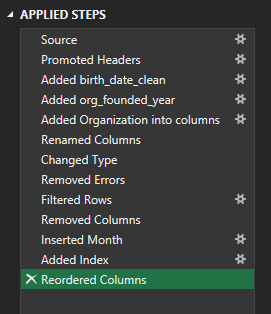

    - 🛠️ nobel_affiliation

        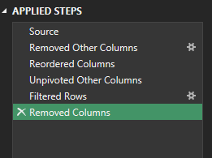

#### 🔗 Load

- Finally, I loaded both transformed queries into the workbook, setting the foundation for my subsequent analysis.
    - 📊 nobel

        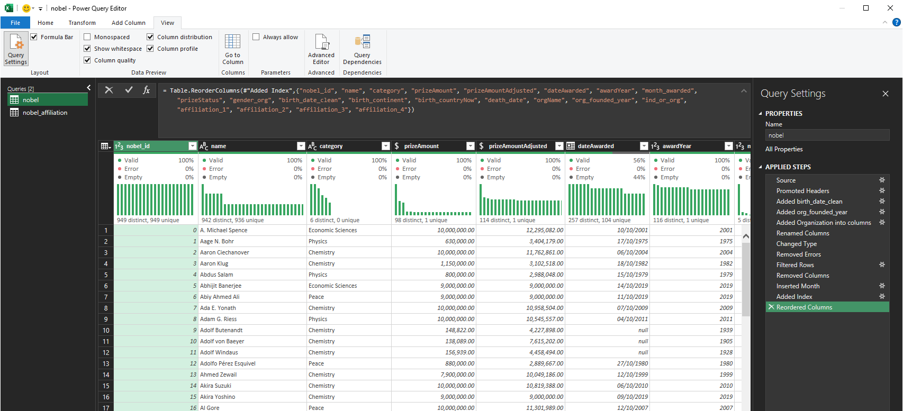

    - 🛠️ nobel_affiliation

        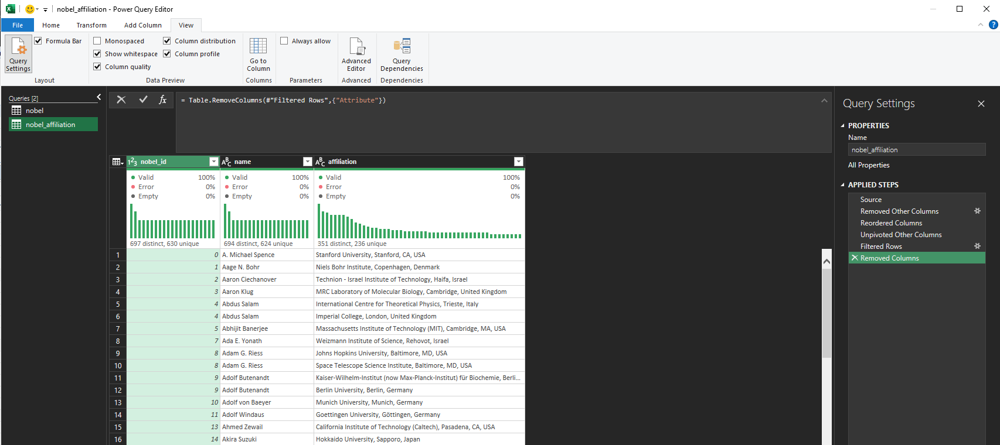


### 🧮 Skills: PivotTables & DAX

#### 📈Pivot Table

- 🔢 I created a PivotTables using the Data Model I created with Power Pivot.

- 🏛️ To analyze institutional affiliations from a related query (`nobel_affiliation`), I used DAX measures with `CROSSFILTER` to enable filtering across related tables.

```
Median Prize Adjusted Aff. :=
CALCULATE(
    [Median Prize Adjusted],
    CROSSFILTER(nobel[nobel_id], nobel_affiliation[nobel_id], BOTH)
)
```
- 👥 To prevent visual errors in charts when no affiliations were found, I wrapped the measure with IF to return 0 instead of blank:

```
Names Affiliated :=
IF(
    ISBLANK(CALCULATE([Names], CROSSFILTER(nobel[nobel_id], nobel_affiliation[nobel_id], BOTH))),
    0,
    CALCULATE([Names], CROSSFILTER(nobel[nobel_id], nobel_affiliation[nobel_id], BOTH))
)
```

#### 🧮 DAX

- 📊 I added new measures to calculate the median prize and median prize adjusted awarded to laureates.

```
  Median Prize := MEDIAN(nobel[prizeAmount])
```

- 🧮 I formatted the `dateAwarded` column to remove timestamps

```
  = FORMAT(nobel[dateAwarded], "yyyy-mm-dd")
```
- 📅 then used the `awardYear` column to fill in missing dates, ensuring every laureate had a complete award date.

```
    =IF(
	ISBLANK([dateAwarded]),
	DATE([awardYear], 1, 1),
	[dateAwarded]
    )
```

### 🔧 Skill: Power Pivot

#### 💪 Power Pivot

- 🔗 I created a data model by integrating the `nobel` and `nobel_affiliation` tables into one model.
- 🧹 Since I had already cleaned the data using Power Query; Power Pivot created a relationship between these two tables.

#### 🔗 Data Model

- I created a relationship between my two tables using the `nobel_id` column.

    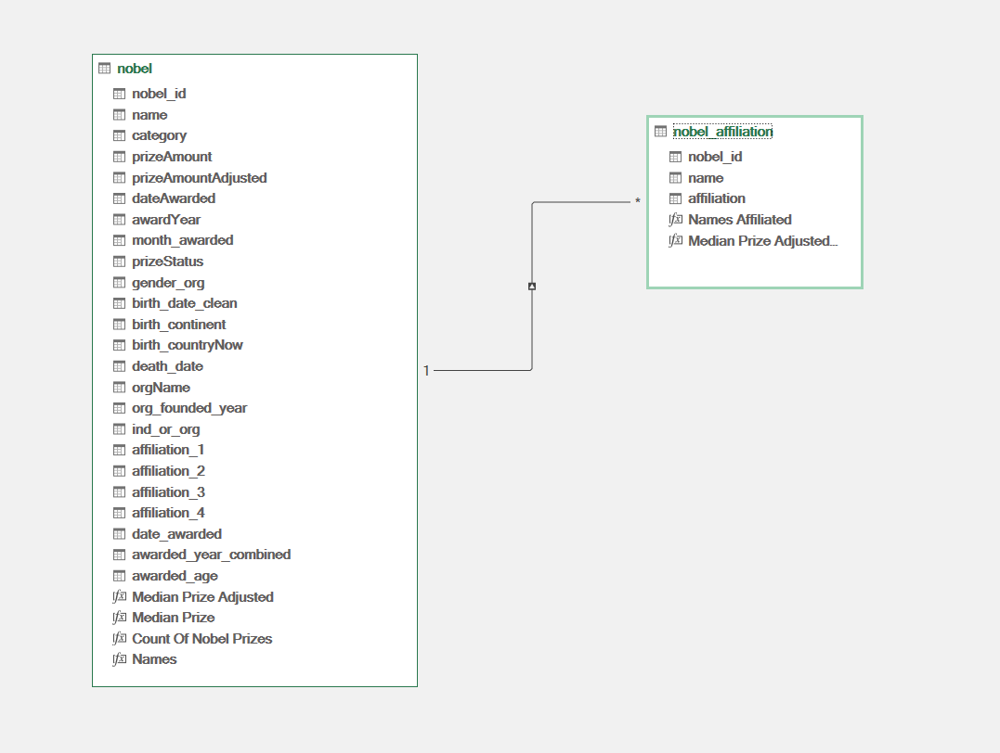

#### 📃 Power Pivot Menu

- The Power Pivot menu was used to refine my data model and makes it easy to create measures.

    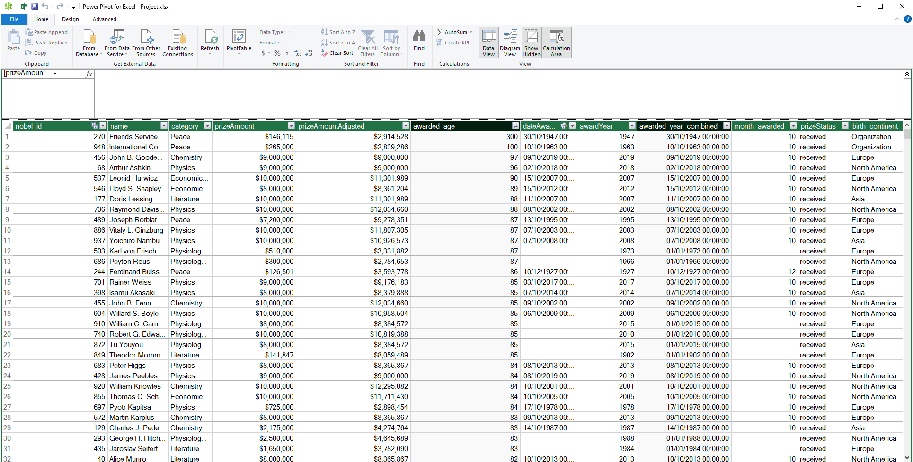


## 1️⃣ How do median prize amounts vary across Nobel categories?

#### 💡 Insights


- 💵 Economic Sciences has the highest median prize value, both in original and inflation-adjusted amounts, followed by Peace and Physics.

- 📉 Literature consistently receives the lowest median prize, even after adjusting for inflation.

- 💰 Adjusted prize values highlight that all categories have experienced significant value erosion over time, especially visible in fields like Chemistry and Literature.

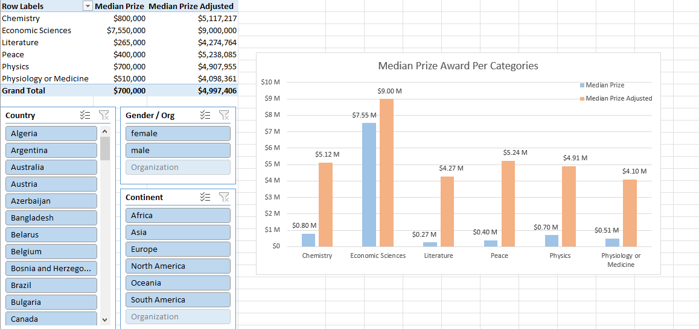

#### 📌 Takeaway

These patterns reveal historical funding priorities and may reflect how different fields are valued economically or politically. Adjusted values also underscore the importance of context when comparing award amounts across decades.

## 2️⃣ What’s the timeline of Nobel Prize distribution over the years?

#### 💡 Insights

- 📈 The number of Nobel Prizes awarded per year has steadily increased over time, especially since the 1950s.

- 🕳️ Sharp drops are observed during major global conflicts — notably World War I (1914–1918) and World War II (1939–1945), when few or no prizes were awarded.

- 🔄 In recent decades, the total number of prizes per year has become more consistent, peaking in the late 1990s and 2000s.

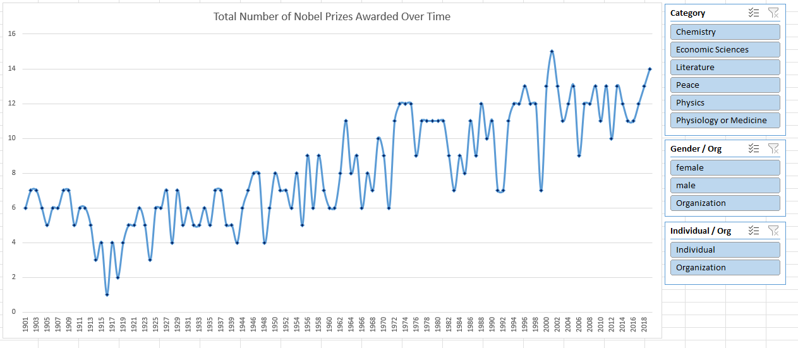

#### 📌 Takeaway

This timeline highlights how global events can disrupt even long-standing institutions like the Nobel Prize. The post-war increase in awards reflects the growth of scientific research and international cooperation. Understanding this trend is key when comparing prize patterns or analyzing laureate demographics across time.

## 3️⃣ Who are the youngest and oldest laureates across different categories?

#### 💡 Insights

- 🧓 Oldest Laureate: John B. Goodenough received the Nobel Prize in Chemistry at 97, making him the oldest Nobel laureate ever.

- 👧 Youngest Laureate: Malala Yousafzai was awarded the Peace Prize at just 17, becoming the youngest Nobel laureate in history.

- 📊 Most of the oldest laureates were recognized in their late 80s and 90s, often for work done decades earlier, reflecting long-term impact and recognition later in life.

- 🌟 In contrast, the youngest laureates were typically awarded in their 20s or early 30s, suggesting early breakthroughs or significant activism, especially in Peace and Physics.

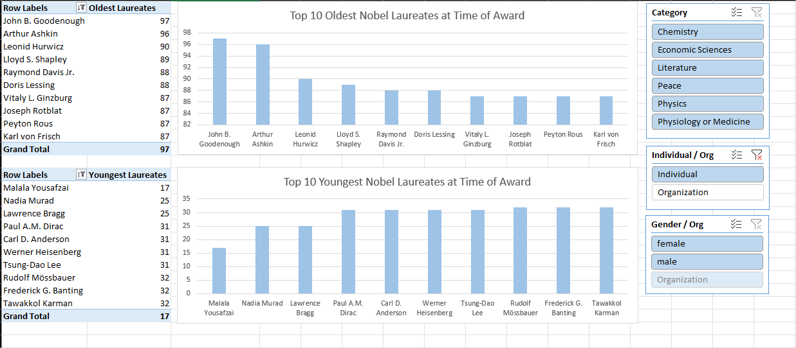

#### 📌 Takeaway

The Nobel Prize doesn't follow a “one age fits all” pattern — breakthrough contributions can happen early or be recognized late. The age extremes show how innovation and influence span a lifetime, from youthful passion to a legacy of persistent research.

## 4️⃣ What are the most affiliated universities and institutions with laureates?

#### 💡 Insights

- 🏆 **Harvard University** leads in Nobel affiliations, with 28 laureates linked to it — the highest among all institutions analyzed.

- 💰 **Columbia** and **Princeton** top the list in terms of median prize amount adjusted, both exceeding **$9M**, indicating not just quantity, but high-value recognition.

- 🇺🇸 The top 10 are overwhelmingly U.S.-based, with only the University of **Cambridge** representing institutions outside the United States.

- 📉 Some schools, like **Caltech**, have fewer affiliations but relatively high median prize values, suggesting fewer but more lucrative awards.

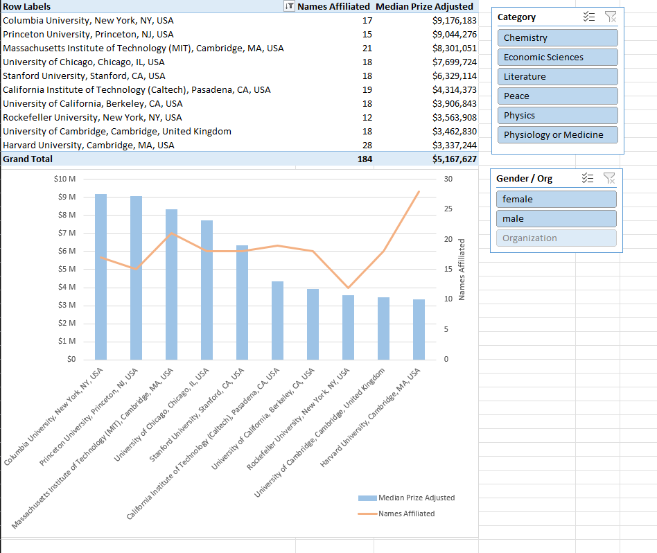

#### 📌 Takeaway

University affiliation remains a strong indicator of Nobel recognition, both in **prestige** and **prize impact**. This reinforces the influence of certain academic ecosystems in fostering groundbreaking research and innovation.

## 5️⃣ Which organizations and individuals have received multiple Nobel Prizes?


#### Incredible Feats

Only four individuals have been awarded the Nobel Prize twice — a rare and prestigious distinction:

- 🧪 Marie Curie: Physics (1903) & Chemistry (1911)

- ⚡ John Bardeen: Physics (1956 & 1972)

- 🧬 Frederick Sanger: Chemistry (1958 & 1980)

- ☮️ Linus Pauling: Chemistry (1954) & Peace (1962)

#### 💡 Insights

- 🏆 A total of **6 recipients** — **4 individuals** and **2 organizations** — have been honored more than once, combining for **13 Nobel Prizes.**

- 📈 **Marie Curie** leads in modern value with over **$15** million, while the **International Committee of the Red Cross** holds the most wins (**3 Nobel Peace Prizes**).

- 🕊️ The Office of the **UN High Commissioner for Refugees (UNHCR)** has also won twice for its humanitarian work.

- 🧬 These laureates span across **Physics, Chemistry,** and **Peace,** with awards given between 1903 and 1981 — showcasing decades of excellence in both scientific advancement and global impact.


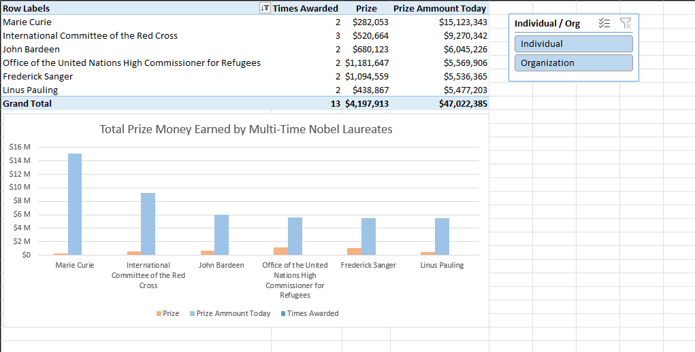

#### 📌 Takeaway

These rare repeat recipients — both individuals and organizations — reflect exceptional, long-term contributions that transcend time and discipline. Their awards span across decades and categories, emphasizing the value of sustained impact in fields like science, peace, and humanitarian work. Adjusted prize values also highlight how recognition changes in financial terms over time, reminding us to consider both historical and present-day significance when evaluating such honors.

## ✅ Conclusion

This project showcases how a century of Nobel Prize history can be distilled into meaningful insights using the power of Excel's analytical tools. Through Power Query, Power Pivot, and DAX, I transformed raw data into a fully interactive dashboard that highlights not only who has won but also how global events, institutions, and individual contributions have shaped the Nobel legacy. Whether it's identifying age extremes among laureates, tracking prize trends over time, or spotlighting institutions with the greatest impact — this analysis underscores how data can tell powerful, human-centered stories when combined with the right tools and questions.