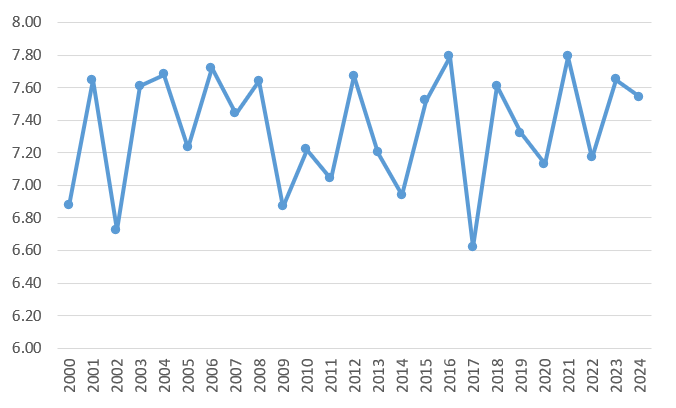
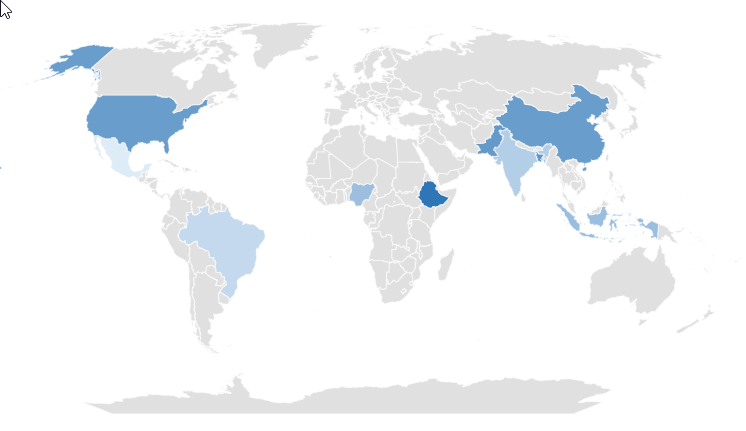
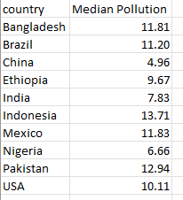
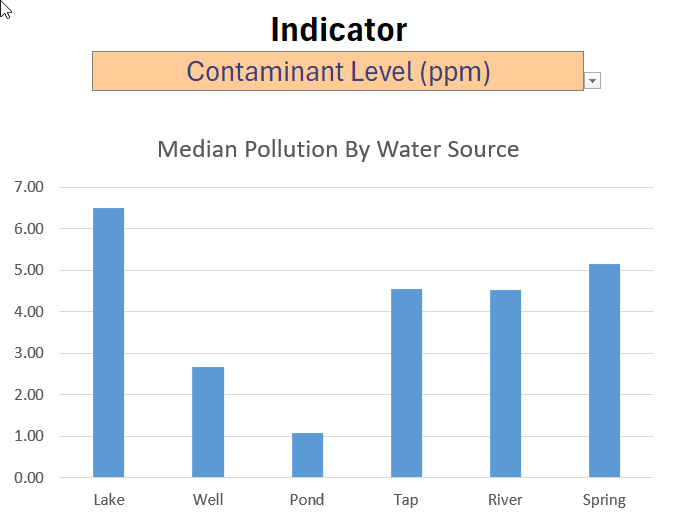

<<<<<<< HEAD
=======
# Water Pollution Dashboard
 
## 🌊 Introduction

This water pollution dashboard was created to explore environmental and water quality conditions across 10 countries using key indicators such as contaminant levels, access to clean water, and urbanization rates.

The dashboard allows users to filter by year, country, and contaminant type to view trends and compare water quality metrics across different water sources. It also highlights the most commonly used water treatment methods in each context.

This project was part of my Excel learning journey, where I practiced building dynamic and interactive dashboards using real-world dataset simulation and advanced Excel features.

🔗 Data Source: [Water Pollution and Disease Dataset on Kaggle](https://www.kaggle.com/datasets/khushikyad001/water-pollution-and-disease/data)

⚠️ Disclaimer: The dataset used in this project contains simulated values and does not represent actual real-world statistics. All results and insights are for demonstration and learning purposes only.

## 📊 Dashboard File
My final dashboard is in [Water_Pollution_Dashboard.xlsx](Water_Pollution_Dashboard.xlsx)

## 🧠 Excel Skills Used
The following Excel skills were utilized for analysis:

- 📉 Charts & Visualizations
- 🔁 Data Validation
- 🧮 Formulas and Functions
- ⚙️ Dynamic Named Ranges and Spill Functions
- 📌 Conditional Formatting & KPI Design

## 💧 Water Pollution Dataset
The dataset used for this project contains water pollution and health-related data across 10 countries, measured over multiple years. It includes detailed information on:

- 🏞️ Water source types (lake, well, river, etc.)
- 🧪 Contaminant levels (lead, nitrates, turbidity, bacteria count, etc.)
- 💧 Water quality metrics (pH level, dissolved oxygen, etc.)
- 🏥 Disease cases (cholera, typhoid, diarrhea)
- 🧑‍🤝‍🧑 Access to clean water
- 📉 GDP per capita, sanitation, healthcare access
  
*Note: For the purposes of this dashboard, the analysis focuses on core water quality indicators, access to clean water, urbanization rate, and water treatment methods — not all available variables were used.*

# Dashboard Build

### 📉 Charts

### 📈 Pollution Trend Over Time – Line Chart



🛠️ Excel Features: Utilized dynamic line chart with named ranges and data validation for selecting the indicator.
📊 Data Representation: Tracks changes in a selected pollution metric (e.g., turbidity, lead concentration, etc.) across multiple years.
🎨 Design Choice: Clean, minimal style with dynamic filtering—lets users change the indicator via dropdown and instantly updates the chart.
🔁 Interactivity: Automatically adjusts based on selected country and indicator, enabling year-over-year comparisons.
💡 Insights Gained: Helps identify whether pollution levels are improving or worsening over time and highlights the effectiveness (or lack) of interventions.


## 🗺️ Median Contaminant Levels by Country – Map Chart



- 🛠️ Excel Features: Used Excel’s map chart to visualize the median contaminant levels across selected countries.
- 🎨 Design Choice: Applied color gradients to indicate severity of pollution levels — darker tones represent higher contamination.
- 📊 Data Representation: Median values were calculated based on selected water quality indicators, filtered by country and year.
- 👁️ Visual Enhancement: Enables immediate comparison between countries’ water conditions.
- 💡 Insights Gained: Helps identify countries with relatively higher pollutant concentrations, drawing attention to potential areas of concern.

## 🧮 Formulas and Functions

💧 Median Pollution by Country
```
=MEDIAN(
 FILTER(
    INDEX(water_pollution, SEQUENCE(ROWS(water_pollution)), MATCH(indicator, water_pollution[#Headers], 0)),
    (water_pollution[Year] = year) *
    (water_pollution[Country] = A2)
 )
)
```
- 🔍 Multi-Criteria Filtering: Filters data based on selected year, country, and indicator.
- 📊 Array Formula: Uses MEDIAN() and FILTER() to dynamically compute central tendencies.
- 🎯 Tailored Insights: Returns specific median pollution levels per country for the chosen indicator.
- 🔢 Formula Purpose: Powers the data table used for generating bar charts, highlighting regional differences in water quality metrics.

### 🍽️ Background Table



## ❎ Data Validation
### 🔍 Filtered List
- 🔒 Enhanced Data Validation: Implementing the filtered list as a data validation rule under the Job Title, Country, and Type option in the Data tab ensures:
  - 🎯 User input is restricted to predefined, validated schedule types
  - 🚫 Incorrect or inconsistent entries are prevented
  - 👥 Overall usability of the dashboard is enhanced




# ✅ Conclusion

I created this dashboard to visualize and explore trends in water pollution across 10 countries. The goal was to provide insights into how environmental and infrastructural factors—like water source type, urbanization rate, and access to clean water—affect water quality over time.

Throughout this project, I practiced dynamic Excel techniques to build an interactive experience where users can filter data by year, country, and specific contaminants. The result is a tool that helps users better understand global water challenges and evaluate pollution patterns with ease.

>>>>>>> 578ec4393ab8aa16df1f73958fea1b0b1ffd02a7
