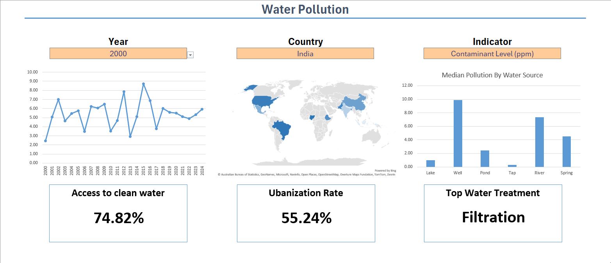

# Water Pollution Dashboard
 
## 🌊 Introduction

This water pollution dashboard was created to explore environmental and water quality conditions across 10 countries using key indicators such as contaminant levels, access to clean water, and urbanization rates.

The dashboard allows users to filter by year, country, and contaminant type to view trends and compare water quality metrics across different water sources. It also highlights the most commonly used water treatment methods in each context.

This project was part of my Excel learning journey, where I practiced building dynamic and interactive dashboards using real-world datasets and advanced Excel features.

## 📊 Dashboard File
My final dashboard is in [Water_Pollution_Dashboard.xlsx](Water_Pollution_Dashboard.xlsx).

## 🧠 Excel Skills Used
The following Excel skills were utilized for analysis:

- 📉 Charts & Visualizations
- 🔁 Data Validation
- 🧮 Formulas and Functions
- ⚙️ Dynamic Named Ranges and Spill Functions
- 📌 Conditional Formatting & KPI Design

## 💧 Water Pollution Dataset
The dataset used for this project contains water pollution and health-related data across 10 countries, measured over multiple years. It includes detailed information on:

- 🏞️ Water source types (lake, well, river, etc.)
- 🧪 Contaminant levels (lead, nitrates, turbidity, bacteria count, etc.)
- 💧 Water quality metrics (pH level, dissolved oxygen, etc.)
- 🏥 Disease cases (cholera, typhoid, diarrhea)
- 🧑‍🤝‍🧑 Access to clean water
- 📉 GDP per capita, sanitation, healthcare access
  
*Note: For the purposes of this dashboard, the analysis focuses on core water quality indicators, access to clean water, urbanization rate, and water treatment methods — not all available variables were used.*
