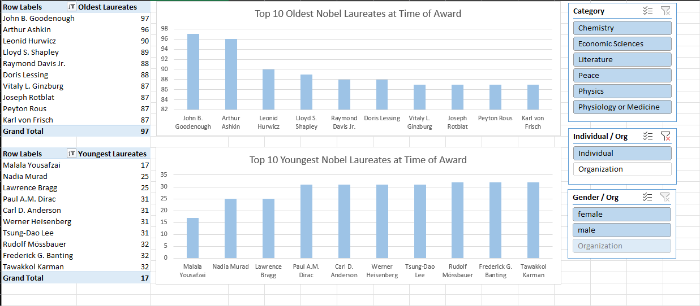

# Excel Projects 📊

Welcome to my Excel Projects repository!  
This repo collects my interactive dashboards and analyses created as part of my Excel learning and practice journey. Each project explores a unique dataset and demonstrates advanced Excel features like dynamic charts, Power Query, Power Pivot, and DAX.

🔎 Inside this repository, you’ll find:

# 📂 Projects

## [🌊 Water Pollution Dashboard](./Project_1/README.md)

-   Explores environmental and water quality conditions across 10 countries.
-   Features interactive filtering by year, country, and contaminant type.
-   Demonstrates charts, dynamic named ranges, array formulas, and conditional formatting.

## [🏆 Nobel Prize Data Analysis](./Project_2/README.md)

-   Analyzes over a century of Nobel Prize awards and laureates.
-   Highlights prize values, recipient ages, affiliations, and repeat winners.
-   Showcases Power Query, Power Pivot, DAX measures, and advanced Excel modeling.

## 🛠️ Skills Highlighted

-   Charts & visualizations (line, bar, maps, KPIs)
-   Data validation & conditional formatting
-   Dynamic named ranges & array formulas
-   Power Query (ETL) for data cleaning
-   Power Pivot & DAX for advanced modeling

## 📑 About

All dashboards are created for learning and demonstration purposes, based on publicly available datasets.  

👉 Click on the project titles or images above to explore detailed breakdowns and dashboards.
